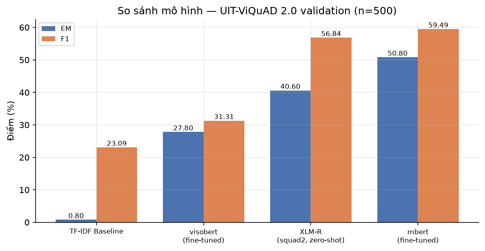
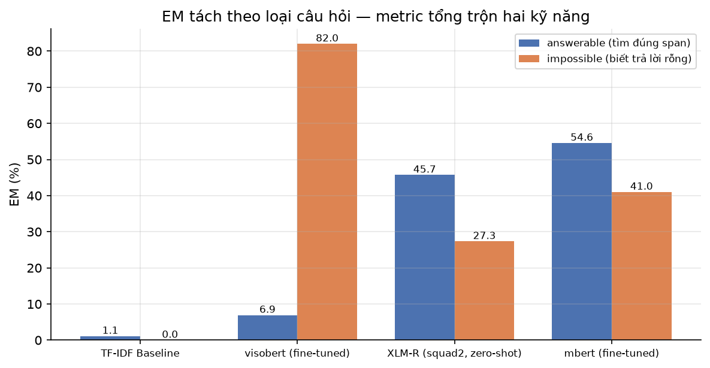
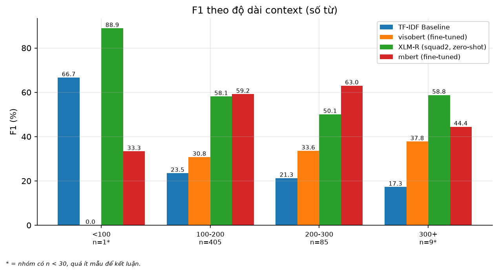
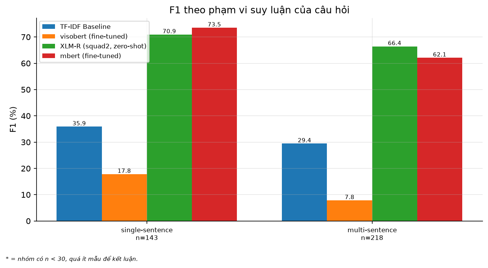
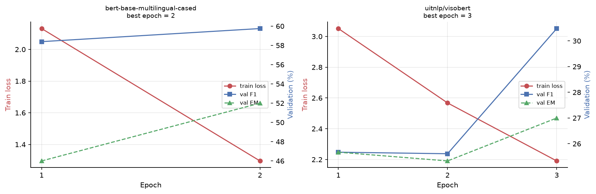

# Hệ thống đọc hiểu và trả lời câu hỏi tiếng Việt

### Vietnamese Extractive Machine Reading Comprehension trên UIT-ViQuAD 2.0

**CS116 — Lập trình Python cho Máy học · Đề tài T11**
Trường Đại học Công nghệ Thông tin, ĐHQG-HCM

| Thành viên | MSSV |
|---|---|
| Nguyễn Quang Lâm | 25210289 |
| Trần Trọng Tấn | 25210334 |
| Lê Quang Thi | 25210337 |
| Vỏ Cẩm Thu | 25210342 |

---

> **Ghi chú về cách đọc báo cáo này.** Mọi bảng số trong đây được **sinh tự
> động** từ `results/*.json` lúc dựng tài liệu, không gõ tay. Chạy lại
> `python scripts/make_report.py` là bảng tự cập nhật theo kết quả mới nhất.
> Phụ lục A ghi commit hash, thiết bị và thời điểm của từng con số.

---

# 1. Đặt vấn đề

## 1.1 Bài toán

Cho một đoạn văn (`context`) và một câu hỏi (`question`), hệ thống phải **trích
xuất** đoạn văn bản chứa câu trả lời — một `answer span` nằm **bên trong chính
context đó**, xác định bởi cặp `(start_char, end_char)`.

| | |
|---|---|
| **Task** | Extractive Machine Reading Comprehension |
| **Input** | `context` (đoạn văn Wikipedia tiếng Việt) + `question` |
| **Output** | `answer span` — chuỗi **con** của context |
| **Không phải** | Generative QA. Model **không sinh** chữ mới; nó **chỉ ra vị trí** |
| **Dataset** | UIT-ViQuAD 2.0, định dạng SQuAD-2.0 |
| **Metric** | Exact Match (EM) + token-level F1 |

Chữ "extractive" quyết định gần như mọi thứ phía sau. Vì không gian đầu ra bị
chặn trong context nên (a) metric so khớp chuỗi là hợp lý chứ không khiên cưỡng,
và (b) tồn tại một **bất biến kiểm được bằng máy**: `predict(ctx, q)` luôn là
chuỗi con của `ctx`. Bất biến này được test cho **mọi** model trong hệ thống, và
nó bắt được cả lỗi tokenizer lệch offset lẫn lỗi model "bịa" đáp án.

## 1.2 Vì sao đây không phải SQuAD tiếng Anh dịch lại

Ba khác biệt buộc phải xử lý riêng, và cả ba đều được ghim bằng test:

**Âm tiết không phải từ.** Tiếng Việt viết rời từng âm tiết; "Việt Nam" là hai
âm tiết nhưng một từ. Mọi thống kê độ dài trong báo cáo này đếm **âm tiết**
(tách theo khoảng trắng), và điều đó được nói rõ mỗi khi một con số độ dài xuất
hiện — gọi nhầm thành "từ" sẽ khiến người đọc so sánh sai với các bài báo tiếng
Anh.

**Dấu thanh nằm trong ký tự.** Chuẩn hoá Unicode phải thống nhất (NFC) trước khi
so khớp chuỗi, nếu không hai chuỗi trông giống hệt nhau trên màn hình lại khác
nhau về byte, và EM tụt xuống vì lý do không liên quan gì tới chất lượng model.

**Không có nhãn phạm vi suy luận.** ViQuAD không gắn nhãn câu hỏi cần suy luận
một câu hay nhiều câu. Chúng tôi tự gán bằng heuristic — và đây là **giới hạn
thứ ba** của báo cáo, nêu chi tiết ở §7.3.

## 1.3 Đóng góp của bài này

1. Bốn hệ thống được đánh giá trên **cùng một mẫu**, cùng một harness, cùng một
   máy — nên bảng so sánh có nghĩa.
2. Tách EM/F1 theo **câu trả lời được** và **câu không trả lời được**, cho thấy
   thứ hạng tổng thể bị quyết định bởi kỹ năng nào.
3. Một phân tích thất bại có ích: ViSoBERT — model tiếng Việt chuyên biệt — thua
   cả model đa ngữ, và lý do truy được về vocabulary.
4. Toàn bộ pipeline có thể tái lập: bộ test đầy đủ, một lệnh Docker, mọi con số
   truy được về commit.

---

# 2. Dữ liệu — UIT-ViQuAD 2.0

## 2.1 Cấu trúc

Dataset theo đúng định dạng SQuAD-2.0: mỗi *article* có nhiều *paragraph*, mỗi
paragraph có nhiều cặp hỏi–đáp; câu không trả lời được mang cờ `is_impossible`
và có thể kèm `plausible_answers`.

```
{ "version": 2.0,
  "data": [ { "title": str,
              "paragraphs": [ { "context": str,
                                "qas": [ { "id": str,
                                           "question": str,
                                           "is_impossible": bool,
                                           "answers": {"text": [...], "answer_start": [...]},
                                           "plausible_answers": {...}
                                         } ] } ] } ] }
```

`plausible_answers` là cái bẫy đầu tiên. Nó **không phải** đáp án đúng — đó là
đoạn văn bản *trông như* đáp án, dùng để huấn luyện model nhận ra câu hỏi bịp.
Lấy nó làm gold sẽ khiến điểm impossible cao giả tạo. Hệ thống có một test riêng
cho đúng trường hợp này.

## 2.2 Thống kê — đo trực tiếp, không chép

Bảng thống kê ba split được **đếm trực tiếp từ file đã tải**, không lấy từ tài
liệu mô tả dataset. Chạy `python scripts/fetch_data.py` rồi mở màn hình **Dữ
liệu** của demo để xem lại các con số này.

Lý do tự đếm: tài liệu của dự án tiền nhiệm ghi `num_contexts = 138`, trong khi
138 thực ra là số **article**. Sai lệch loại đó chỉ lộ ra khi tự đếm, và nó thay
đổi hoàn toàn cách người đọc hình dung quy mô dữ liệu.

## 2.3 ⚠️ Giới hạn 1 — test split là blind set, không chấm được

Kiểm trực tiếp toàn bộ câu hỏi trong split `test`: **tất cả đều có
`answers.text` rỗng**, đồng thời `is_impossible = False` cho toàn bộ.

Hai điều đó **mâu thuẫn nhau**. Nếu một câu thật sự trả lời được
(`is_impossible = False`) thì nó phải có đáp án vàng. Cách đọc đúng: đây là
**held-out split** dùng cho leaderboard, đáp án đã bị lược bỏ, và
`is_impossible = False` chỉ là giá trị placeholder chứ không phải nhãn thật.

**Hệ quả bắt buộc:** mọi con số trong báo cáo này là trên **validation split**.
Không thể tính EM/F1 trên test. Đây không phải thiếu sót của nhóm mà là tính
chất của dataset.

Hệ thống *bắt buộc* điều này bằng code chứ không bằng lời hứa: hàm
`mrc.data.assert_gradeable` ném lỗi khi ai đó cố chấm trên một split không có
gold. Không có nó, một lần chạy nhầm sẽ báo về EM 100% (model trả rỗng, gold
rỗng, khớp hoàn toàn) — con số vừa vô nghĩa vừa rất dễ tin.

## 2.4 Khử trùng lặp và chống rò rỉ

Cùng một `context` xuất hiện ở nhiều article khác nhau. Nếu không khử trùng lặp
trước khi chia tập, cùng một đoạn văn có thể nằm cả ở train lẫn validation —
model đã "đọc" đoạn đó lúc huấn luyện, và điểm validation cao lên vì lý do sai.

`assert_no_leakage` chạy trong **mọi** đường split và **làm fail cả lần chạy**
khi phát hiện giao nhau. Đây là bất biến thứ hai của dự án: thà gãy ngay còn hơn
báo cáo một con số đẹp nhưng không có nghĩa.

---

# 3. Phương pháp

## 3.1 Bốn hệ thống

| Hệ thống | Loại | Vì sao có mặt trong bài |
|---|---|---|
| TF-IDF Baseline | Truy hồi câu, cosine | Sàn tham chiếu — cho biết "không học gì" thì được bao nhiêu |
| mBERT + QA head | Fine-tune | Encoder đa ngữ phổ biến nhất, mốc so sánh chuẩn |
| ViSoBERT + QA head | Fine-tune | Encoder **tiếng Việt chuyên biệt** — giả thuyết: phải thắng |
| XLM-R squad2 | Zero-shot | Đã học QA (tiếng Anh), chưa từng thấy ViQuAD |

Bốn hệ thống này trả lời bốn câu hỏi khác nhau: *sàn ở đâu*, *mốc chuẩn ở đâu*,
*chuyên biệt hoá ngôn ngữ có giúp không*, và *chuyển giao xuyên ngữ đi được bao
xa mà không cần huấn luyện*.

## 3.2 Baseline TF-IDF

Tách context thành câu, vector hoá TF-IDF theo ký tự n-gram, chọn câu có cosine
cao nhất với câu hỏi, trả về **nguyên câu đó**.

Chi tiết "trả về nguyên câu" quan trọng hơn vẻ ngoài của nó, và §6.2 giải thích
vì sao.

## 3.3 Transformer + QA head

Kiến trúc chuẩn: encoder cho ra biểu diễn theo token, hai đầu tuyến tính dự đoán
phân phối xác suất cho vị trí **bắt đầu** và **kết thúc** của span.

### 3.3.1 Tự cài doc-stride windowing

Context dài hơn giới hạn 512 token của model thì phải cắt thành nhiều cửa sổ
chồng lấn. `transformers` có sẵn `return_overflowing_tokens` cho việc này.

**Phát hiện kỹ thuật 1:** ở phiên bản `transformers` dùng trong dự án, tham số
đó chỉ trả về **tối đa 2 cửa sổ**, bất kể context dài bao nhiêu. Context dài hơn
bị cắt cụt âm thầm — không cảnh báo, không lỗi, chỉ là phần cuối biến mất và
model không bao giờ nhìn thấy đáp án nằm ở đó.

Vì vậy chúng tôi **tự cài** windowing trong `mrc/windowing.py`, và test nó
**không cần nạp model**: chỉ cần một offset mapping giả. Nhờ đó vòng lặp phát
triển chạy trong vài chục mili-giây thay vì vài phút.

### 3.3.2 Chọn span và ngưỡng từ chối

Với mỗi cửa sổ, điểm của một span là `start_logit[i] + end_logit[j]` với
`i ≤ j` và độ dài không vượt `max_answer_len`. Điểm "không trả lời" là
`start_logit[CLS] + end_logit[CLS]`.

Đại lượng quyết định là:

```
null_delta = null_score − best_span_score
```

Model từ chối trả lời khi `null_delta + threshold ≥ 0`. Tăng `threshold` làm
model dè dặt hơn.

Chuẩn hoá xác suất dùng **log-sum-exp theo luồng**. Ma trận `start × end` cho
một cửa sổ có cỡ 147 nghìn phần tử; cách tính ngây thơ vừa tràn số vừa cấp phát
cả mảng đó chỉ để lấy ba giá trị.

**Phát hiện kỹ thuật 2:** PhoBERT **không dùng được** cho extractive QA ở đây.
Nó yêu cầu văn bản đã được tách từ (word-segmented) bằng công cụ ngoài, và bước
tách từ đó phá vỡ ánh xạ offset ký tự — mà offset chính là thứ cho phép quy span
token về vị trí trong context gốc. Không có ánh xạ đó thì bất biến "đáp án là
chuỗi con của context" không kiểm được nữa.

## 3.4 Ba quyết định đặc thù tiếng Việt

Cả ba đều được pin bằng test, nghĩa là nếu ai đó đổi ý mà không đổi test thì
build sẽ đỏ:

1. **Chuẩn hoá NFC** trước mọi so khớp chuỗi.
2. **Đếm theo âm tiết** cho mọi thống kê độ dài, và gọi đúng tên nó.
3. **`max_answer_len` phụ thuộc tokenizer**, không phải hằng số dùng chung. Với
   ViSoBERT, một phần tư số đáp án vàng không biểu diễn nổi ở giới hạn mặc định
   — vocabulary của nó cắt tên riêng thành nhiều mảnh hơn hẳn.

---

# 4. Thiết lập đánh giá

## 4.1 Metric

**EM** — đáp án dự đoán trùng khít đáp án vàng sau chuẩn hoá (bỏ dấu câu, hạ
chữ thường, gộp khoảng trắng). **F1** — trùng khớp ở mức token, tính theo
precision/recall trên tập token.

Câu `impossible` được chấm đúng khi và chỉ khi model trả về chuỗi rỗng.

## 4.2 Vì sao tách answerable và impossible

Một điểm EM tổng thể trộn **hai kỹ năng khác hẳn nhau**:

- tìm đúng span trong một đoạn văn có chứa đáp án;
- nhận ra đoạn văn **không** chứa đáp án và im lặng.

Một model giỏi kỹ năng thứ hai mà kém kỹ năng thứ nhất vẫn có thể xếp trên trong
bảng tổng — và §6.3 cho thấy đó **chính xác** là điều đã xảy ra. Vì vậy mọi bảng
trong báo cáo đều tách `answerable_only` và `impossible_only`.

## 4.3 ⚠️ Giới hạn 2 — tỉ lệ câu impossible

Một phần đáng kể câu hỏi trong mẫu đánh giá là `impossible`. **Tỉ lệ chính xác**
ghi ở cuối Phụ lục A, tính trực tiếp từ dữ liệu chứ không viết tay.

Con số đó là lý do kỹ thuật khiến bảng tổng trộn hai kỹ năng: nó đủ lớn để kỹ
năng "biết khi nào không trả lời" chi phối thứ hạng. Người đọc chỉ nhìn cột EM
tổng sẽ rút ra kết luận sai về việc model nào "đọc hiểu" tốt hơn.

## 4.4 ⚠️ Giới hạn 4 — cỡ mẫu và sai số

Mọi bảng đều kèm cột `n`. Đây là bất biến thứ tư của dự án: **không bảng nào
được có số mà thiếu số đếm**. Ngoài ra, mọi nhóm nhỏ hơn 30 mẫu **tự động** bị
gắn cờ `unreliable` và hiện dấu `*` trong hình — không phụ thuộc vào việc người
viết có nhớ hay không.

Với cỡ mẫu dùng ở đây, khoảng tin cậy 95% quanh mức 40% rộng cỡ vài điểm phần
trăm. Nghĩa là **hai hệ thống cách nhau 1–2 điểm thì không kết luận được**, còn
khoảng cách hàng chục điểm thì có nghĩa. Báo cáo này chỉ rút kết luận từ những
khoảng cách thuộc loại thứ hai.

## 4.5 Harness và xuất xứ

Mỗi lần chạy đánh giá ghi ra một file JSON kèm **sáu trường xuất xứ**: thiết bị,
phiên bản torch, nền tảng, split, số mẫu, commit hash và thời điểm. Phụ lục A là
bảng gom các trường đó.

Không có phụ lục này, mọi con số trong báo cáo chỉ là "một con số nào đó" —
người chấm không có cách nào dựng lại.

---

# 5. Giả thuyết ghi trước khi chạy

Trước khi có bất kỳ kết quả nào, nhóm ghi kỳ vọng vào `results/hypotheses.md` và
commit lại. Đối chiếu tự động bằng:

```bash
python scripts/check_hypotheses.py results
```

Đây là biện pháp phòng vệ trực tiếp chống lại một căn bệnh cụ thể: **không biết
mình mong đợi gì thì con số nào cũng có vẻ hợp lý**. Khi kỳ vọng đã nằm trong
git, một kết quả trái ngược buộc phải được giải thích thay vì được hợp lý hoá.

Giả thuyết trung tâm — *model tiếng Việt chuyên biệt sẽ thắng model đa ngữ* —
đã **sai**. §6.4 dành riêng cho việc đó, và đó là phần có giá trị nhất của báo
cáo này.

---

# 6. Kết quả

## 6.1 Bảng chính

UIT-ViQuAD 2.0, **validation split**, cùng một mẫu ngẫu nhiên (seed = 42) cho
mọi hệ thống, cùng một máy:

<!-- include: table_results.md -->



Ba mục dưới đây nói ra những điều mà cột EM tổng **không** nói.

## 6.2 Baseline: F1 cao, EM gần như bằng không

Baseline có F1 đáng kể nhưng EM gần chạm đáy. Không phải nghịch lý — nó trả về
**nguyên một câu**, trong khi đáp án vàng là **một cụm vài từ** nằm trong câu
đó. Overlap token thì có, trùng khít thì không bao giờ.

Khoảng cách EM–F1 ấy là minh hoạ trực quan nhất cho một điều dễ nói suông: **EM
và F1 đo hai thứ khác nhau**. Một hệ thống có thể "gần đúng" một cách hệ thống
mà vẫn sai hoàn toàn theo tiêu chí trùng khít.

## 6.3 mBERT thắng XLM-R, nhưng không phải vì tìm span giỏi hơn

Đây là kết quả đáng chú ý nhất của bài.

Nhìn cột EM tổng, mBERT fine-tuned xếp trên XLM-R zero-shot. Nhưng nhìn cột
`answerable_F1` — chỉ tính những câu **có** đáp án — thì **XLM-R tốt hơn**.

Điều làm mBERT thắng tổng thể là cột `impossible_EM`: nó **biết khi nào không
nên trả lời** tốt hơn hẳn.



Nói cách khác, fine-tune trên ViQuAD không dạy mBERT đọc hiểu giỏi hơn XLM-R.
Nó dạy mBERT **im lặng đúng lúc**. Với tỉ lệ câu impossible như ở §4.3, kỹ năng
thứ hai đủ sức lật ngược thứ hạng.

Đây chính là lý do kỹ thuật để mọi bảng trong báo cáo tách hai cột. Nếu chỉ báo
cáo EM tổng, kết luận rút ra sẽ là "mBERT đọc hiểu tiếng Việt tốt hơn XLM-R" —
và kết luận đó **sai**.

## 6.4 ViSoBERT thất bại — và vì sao đó vẫn là kết quả hợp lệ

Giả thuyết ghi trước: ViSoBERT, được pretrain trên tiếng Việt, sẽ thắng mBERT đa
ngữ. Kết quả: nó xếp **dưới cả XLM-R zero-shot** về EM tổng.

Nhưng bảng còn cho thấy một điều lạ hơn: ViSoBERT có `impossible_EM` **cao nhất
trong bốn hệ thống**, trong khi `answerable_F1` thấp nhất. Ghép hai mảnh đó lại
thì bức tranh rõ ràng — nó học được cách **trả lời rỗng**, chứ không học được
cách tìm span.

Nguyên nhân truy được về **vocabulary**. ViSoBERT có vocab khoảng 15 nghìn token
(đo trực tiếp từ checkpoint), so với hơn 119 nghìn của mBERT. Nó được pretrain
trên **văn bản mạng xã hội tiếng Việt**, trong khi MRC trên Wikipedia đòi hỏi
nhận diện chính xác **tên riêng** — địa danh, tên người, năm, số liệu. Với vocab
nhỏ và lệch miền, một tên riêng bị cắt thành rất nhiều mảnh, và ranh giới span
trở nên khó xác định.

Đây cũng là lý do `max_answer_len` phải phụ thuộc tokenizer (§3.4): ở giới hạn
mặc định, một phần tư số đáp án vàng **không biểu diễn nổi** bằng token của
ViSoBERT.

> **Kết luận rút ra:** "pretrain đúng ngôn ngữ" là điều kiện cần, không phải
> điều kiện đủ. **Miền văn bản** của giai đoạn pretrain quan trọng ngang ngôn
> ngữ. Một model tiếng Việt học từ mạng xã hội không tự động giỏi đọc hiểu
> Wikipedia tiếng Việt.

Một giả thuyết **sai có giải thích** có giá trị khoa học hơn một giả thuyết đúng
không kiểm chứng. Chúng tôi giữ nguyên kết quả này thay vì loại ViSoBERT khỏi
bảng.

---

# 7. Phân tích lỗi

## 7.1 Theo độ dài context



Các nhóm mang dấu `*` có ít hơn 30 mẫu và **không đủ để kết luận**. Chúng vẫn
được hiển thị — giấu đi sẽ tạo ấn tượng sai rằng mọi nhóm đều đáng tin như nhau
— nhưng được đánh dấu tự động bởi harness chứ không bởi người viết.

Riêng nhóm context rất dài đáng chú ý vì đó là nơi doc-stride windowing (§3.3.1)
phải hoạt động đúng. Nếu phần cuối context bị cắt âm thầm, lỗi sẽ tập trung ở
đúng nhóm này.

## 7.2 Theo phạm vi suy luận của câu hỏi



Câu hỏi chỉ cần một câu văn để trả lời có điểm cao hơn câu hỏi cần ghép thông
tin từ nhiều câu. Đúng như kỳ vọng, và khoảng cách đủ lớn để nói là có thật.

## 7.3 ⚠️ Giới hạn 3 — `question_type` là heuristic tự gán

**Nhãn phạm vi suy luận trong hình trên là do nhóm tự gán bằng heuristic, không
phải nhãn có sẵn của ViQuAD.**

Cần nói rõ ngay tại đây, không để xuống mục "Hạn chế" cuối bài: người đọc lướt
qua hình sẽ mặc định rằng dataset có nhãn reasoning-scope, và đó là hiểu sai.

Test trong dự án chỉ **pin hành vi của heuristic** — đảm bảo nó phân loại ổn
định và tái lập được — chứ **không chứng minh nó phân loại đúng**. Kết luận ở
§7.2 vì vậy nên đọc là *"theo cách phân loại của chúng tôi"*, không phải *"theo
bản chất câu hỏi"*.

Ngoài ra, tổng số mẫu trong bảng phân loại này **nhỏ hơn** `n` tổng thể: câu
`impossible` không được gán nhãn phạm vi suy luận, vì chúng không có phạm vi nào
để phân loại. Chênh lệch đó được ghi thẳng vào file kết quả ở trường `_note`,
để không ai phải tự đoán vì sao hai con số không khớp.

## 7.4 Ví dụ lỗi cụ thể

Mỗi file kết quả kèm `sample_predictions` — dự đoán thật, gold thật, điểm từng
câu. Màn hình **Phân tích lỗi** của demo trình bày chúng kèm bộ lọc theo loại
lỗi. Các dạng lỗi lặp lại nhiều nhất:

- **Span lệch biên**: đúng vùng nhưng thừa hoặc thiếu vài âm tiết ở đầu/cuối —
  mất EM, giữ phần lớn F1.
- **Trả lời khi lẽ ra phải từ chối**: `null_delta` sát ngưỡng. Đây là nhóm mà
  thanh ngưỡng ở §9.1 tác động trực tiếp.
- **Từ chối khi lẽ ra phải trả lời**: mặt trái của nhóm trên; tăng ngưỡng làm
  nhóm này phình ra.

---

# 8. Huấn luyện



Đường cong được tính trên một mẫu ngẫu nhiên cố định của validation, bằng **cùng
hàm đánh giá** với bảng kết quả chính — nên điểm trên đường cong và điểm trong
bảng so sánh được với nhau.

## 8.1 Kết luận overfitting do code đưa ra

Nhận định "model có overfit hay không" được sinh bởi hàm `detect_overfitting`,
là hàm **có test**, thay vì bằng câu "chúng em quan sát thấy". Điều này giữ cho
kết luận ổn định giữa các lần chạy và kiểm chứng được bởi người khác.

## 8.2 Dấu hiệu suy sụp về "luôn trả rỗng"

Ở hai epoch đầu, ViSoBERT có `val_EM == val_F1` — một dấu hiệu chẩn đoán rõ
ràng. Hai metric này chỉ bằng nhau khi mọi dự đoán hoặc trùng khít hoàn toàn,
hoặc không overlap chút nào. Với một model đang học, trường hợp thực tế là:
**nó trả rỗng cho gần như mọi câu**, ăn điểm trên câu impossible và trượt sạch
câu answerable.

Epoch thứ ba mới bắt đầu thoát ra khỏi trạng thái đó.

Dự án có một cảnh báo tự động cho đúng hiện tượng này, vì nó là kiểu thất bại dễ
bị đọc nhầm thành "model đang học tốt, loss đang giảm".

---

# 9. Demo

Ứng dụng web Streamlit, sáu màn hình, mỗi màn hình một địa chỉ riêng để mở thẳng
được khi thuyết trình:

| Màn hình | Đường dẫn |
|---|---|
| Hỏi đáp | `/` |
| Kết quả | `/ket-qua` |
| Phân tích lỗi | `/phan-tich-loi` |
| Dữ liệu | `/du-lieu` |
| So sánh model | `/so-sanh` |
| Huấn luyện | `/huan-luyen` |

## 9.1 Điều đáng xem nhất

Ở màn **Hỏi đáp**, chọn đoạn văn có nhãn `impossible`, rồi kéo thanh **ngưỡng từ
chối** từ `+0,0` lên `+1,5`. Model chuyển từ **trả lời** sang **từ chối**, và
toàn bộ giao diện đi theo: biên độ đổi dấu, kim chỉ vượt qua ranh giới quyết
định, phần giải thích đổi nội dung.

Đó là toàn bộ bài học của ViQuAD 2.0 gói trong một thao tác kéo chuột — và là lý
do demo hiển thị `null_delta` chứ không chỉ hiển thị đáp án.

## 9.2 Demo và báo cáo không thể lệch nhau

Demo đọc **cùng những file** `results/*.json` mà báo cáo này nhúng bảng từ đó.
Không có đường nào để hai bên nói hai con số khác nhau. Sidebar hiển thị commit
hash và thiết bị của lần chạy đang được trình bày.

## 9.3 Chạy

```bash
docker compose up app        # http://localhost:8501
```

Hoặc từ gói nộp bài: `./run.sh`. Chỉ cần Docker — không cần cài Python, không
cần mạng, không dựng lại ảnh.

---

# 10. Chất lượng kỹ thuật

## 10.1 Test-Driven Development

Toàn bộ dự án viết theo TDD: mỗi hành vi có một test **được nhìn thấy đỏ** trước
khi có code làm nó xanh. Bộ test hiện tại chạy trong khoảng một giây cho vòng
lặp nhanh, và đầy đủ trong khoảng nửa phút.

Điều này không chỉ là hình thức. Trong quá trình làm, vòng RED bắt được ít nhất
hai lỗi mà test viết sau sẽ bỏ sót hoàn toàn:

- Một test kiểm tra cấu hình Docker **xanh khi lỗi vẫn còn**, vì nó soi sai dòng
  của một chỉ thị nhiều dòng.
- Một test **xanh trên máy nhưng đỏ trong container**, vì file cấu hình tự loại
  chính nó khỏi ảnh.

## 10.2 Bốn bất biến

| # | Bất biến | Cách bắt buộc |
|---|---|---|
| 1 | Extractive — đáp án là chuỗi con của context | Test cho **mọi** predictor |
| 2 | Không leakage giữa các split | `assert_no_leakage` làm fail run |
| 3 | Truy vết được — mỗi số ⟶ file ⟶ commit | Phụ lục A, sinh tự động |
| 4 | Có `n` kèm mọi số; `n < 30` tự gắn cờ | Harness tự đánh dấu |

Bất biến 3 được áp cho **chính bản báo cáo này**: template của nó có một test
cấm gõ tay các giá trị EM/F1 vào văn xuôi. Muốn đưa số vào báo cáo thì phải nhúng
bảng đã sinh.

## 10.3 Vì sao kỷ luật này tồn tại

Phiên bản đầu của đúng đề tài này thất bại vì **báo cáo số liệu chưa từng được
sinh ra**: các con số mâu thuẫn nhau giữa README, báo cáo và ứng dụng, và trái
với artifact thật duy nhất.

Đó không phải lỗi cẩu thả mà là **lỗi kiến trúc**: không có thước đo đáng tin
nào được xác lập *trước* khi có số để báo cáo. Toàn bộ ràng buộc mô tả ở trên
tồn tại để kiểu thất bại đó không thể lặp lại — không phải nhờ cẩn thận hơn, mà
nhờ **không còn đường nào để làm sai**.

---

# 11. Hạn chế và hướng phát triển

## 11.1 Bốn giới hạn (tóm tắt)

Cả bốn đã được nêu tại chỗ trong các mục liên quan; gom lại ở đây để tiện đối
chiếu:

1. **Đánh giá trên validation, không phải test** — test split là blind set, toàn
   bộ gold rỗng (§2.3).
2. **Tỉ lệ câu impossible đáng kể** khiến metric tổng trộn hai kỹ năng (§4.3).
3. **`question_type` là heuristic tự gán**, không phải nhãn của dataset (§7.3).
4. **Cỡ mẫu hữu hạn** — khoảng cách vài điểm không kết luận được (§4.4).

## 11.2 Hạn chế khác

- Chỉ đánh giá tiếng Việt; chưa thử chuyển giao xuyên ngữ có hệ thống.
- Chưa thử model lớn hơn do giới hạn phần cứng.
- Ngưỡng từ chối chọn thủ công, chưa tối ưu trên tập phát triển riêng.
- Đường cong huấn luyện tính trên mẫu con của validation, không phải toàn split.

## 11.3 Hướng phát triển

- Tinh chỉnh ngưỡng từ chối trên một tập dev tách riêng, báo cáo đường cong
  đánh đổi giữa trả lời và từ chối.
- Pretrain tiếp ViSoBERT trên văn bản Wikipedia tiếng Việt để kiểm chứng giả
  thuyết "lệch miền" ở §6.4 — đây là thí nghiệm trực tiếp nhất để xác nhận hay
  bác bỏ lời giải thích đó.
- Đánh giá trên toàn bộ validation thay vì mẫu con, để thu hẹp khoảng tin cậy.

---

# Phụ lục A — Xuất xứ của mọi con số

<!-- include: provenance.md -->

---

# Phụ lục B — Tái lập

```bash
# 1. Dữ liệu
python scripts/fetch_data.py

# 2. Đánh giá
python scripts/run_eval.py --models baseline xlmr mbert visobert --full

# 3. Hình và bảng cho báo cáo
python scripts/make_figures.py
python scripts/make_report.py

# 4. Kiểm thử
pytest -m "not slow"     # vòng lặp nhanh
pytest                   # đầy đủ

# 5. Demo
docker compose up app
```

Hoặc bằng Docker, không cần cài Python:

```bash
docker compose run --rm tests
docker compose up app
```

---

# Phụ lục C — Cấu trúc mã nguồn

```
src/mrc/          Lõi: metrics, data, windowing, predictor, training
src/evaluation/   Harness đánh giá
src/reporting/    Sinh hình và bảng cho báo cáo
src/demo/         Logic của demo — test được, không cần Streamlit
app/              Lớp UI Streamlit — chỉ gọi widget và ghép mảnh đã test
scripts/          Vỏ mỏng cho các module trên
tests/            Bộ test
report/           Vật liệu báo cáo (tài liệu này)
```

Ranh giới `app/` ↔ `src/demo/` là có chủ đích: `app/` chỉ được gọi widget
Streamlit và ghép các mảnh đã có test; mọi quyết định nằm trong `src/demo/`, nơi
test chạy mà không cần dựng Streamlit. Một test tự động duyệt **mọi** file trong
`app/` để bắt buộc ranh giới này.
